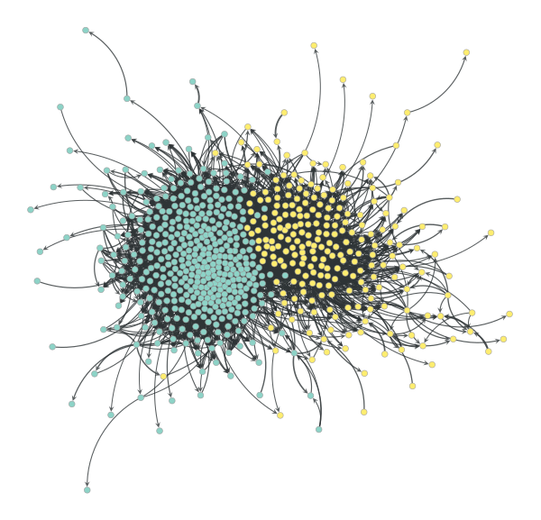

# Additional data for *Automatic Detection of Influential Actors in Disinformation Networks*

This repository contains additional data used for the paper:

> S.T. Smith, E.K. Kao, E.D. Mackin, D.C. Shah, O. Simek, and
> D.B. Rubin, Automatic detection of influential actors in
> disinformation networks, *Proc. Natl. Acad. Sci. U.S.A.*, to appear,
> doi:[10.1073/pnas.2011216118](https://doi.org/10.1073/pnas.2011216118).

The data represents narrative networks for both the English (`en`) and
French (`fr`) language narratives analyzed in the paper. The
comma-separated value (`.csv`) files `en_influence_network.csv` and
`en_tweet_time_weight.csv` represent the English narrative network,
and the correspondingly named files represent the French network.

The files `*_influence_network.csv` contain a directed graph whose
vertices are defined by the Twitter [user
id](https://developer.twitter.com/en/docs/twitter-api/v1/data-dictionary/overview/user-object)
along with edge weights determined by the number of times a Twitter
user (`to` column) retweets another user (`from` column) within the
corresponding narrative, so that edge direction corresponds to the
direction of influence. This graph is used as the prior Poisson
distribution of the influence network, described in the main paper,
Section *[Methodology:Network
Discovery](https://doi.org/10.1073/pnas.2011216118)*.

The files `*_tweet_time_weight.csv` contain a list of tweets on the
narrative by specific Twitter users (`uid` column), [tweet
id](https://developer.twitter.com/en/docs/twitter-api/v1/data-dictionary/object-model/tweet)
(`tweet_id`), tweet or retweet time (`tweet_time`) in coordinated
universal time (UTC), and weight of the tweet (`narrative_weight`)
within the narrative represented in Fig.&nbsp;2 of the [main
paper](https://doi.org/10.1073/pnas.2011216118). These tweets are the
observed outcomes used for impact estimation of a specific narrative,
described in the main paper, Section *[Methodology:Impact
Estimation](https://doi.org/10.1073/pnas.2011216118)*.


## Data loading with Python `pandas`

```python
import datetime as dt, pandas as pd

df_graph = pd.read_csv(
               'en_influence_network.csv.zip',
               compression='zip',
               index_col=0)
df_tweets = pd.read_csv(
               'en_tweet_time_weight.csv.zip',
               compression='zip',
               index_col=0,
               converters=dict(tweet_time=
                   lambda x: dt.datetime.strptime(x, '%m/%d/%Y %H:%M:%S')))
df_graph.sample(5).to_html()
df_tweets.sample(5, weights="narrative_weight").to_html(
    formatters=dict(
        uid=lambda x: f'<a href="https://twitter.com/intent/user?user_id={x}">{x}</a>',
        tweet_id=lambda x: f'<a href="https://twitter.com/i/web/status/{x}">{x}</a>'),
        escape=False)
```

##### `en_influence_network.csv`

<table border="1" class="dataframe">
  <thead>
    <tr style="text-align: right;">
      <th></th>
      <th>from</th>
      <th>to</th>
      <th>weight</th>
    </tr>
  </thead>
  <tbody>
    <tr>
      <th>31942</th>
      <td>820637114765348864</td>
      <td>1045558231</td>
      <td>1</td>
    </tr>
    <tr>
      <th>7495</th>
      <td>954124423</td>
      <td>925801148</td>
      <td>21</td>
    </tr>
    <tr>
      <th>17119</th>
      <td>1674315427</td>
      <td>817590341146705921</td>
      <td>6</td>
    </tr>
    <tr>
      <th>16225</th>
      <td>1626294277</td>
      <td>4800678578</td>
      <td>1</td>
    </tr>
    <tr>
      <th>19933</th>
      <td>210556794</td>
      <td>798250897</td>
      <td>2</td>
    </tr>
  </tbody>
</table>

##### `en_tweet_time_weight.csv`

<table border="1" class="dataframe">
  <thead>
    <tr style="text-align: right;">
      <th></th>
      <th>uid</th>
      <th>tweet_id</th>
      <th>tweet_time</th>
      <th>narrative_weight</th>
    </tr>
  </thead>
  <tbody>
    <tr>
      <th>6728</th>
      <td><a href="https://twitter.com/intent/user?user_id=934399189">934399189</a></td>
      <td><a href="https://twitter.com/i/web/status/858451540570517509">858451540570517509</a></td>
      <td>2017-04-29 22:42:51</td>
      <td>0.548804</td>
    </tr>
    <tr>
      <th>3106</th>
      <td><a href="https://twitter.com/intent/user?user_id=842376662658514944">842376662658514944</a></td>
      <td><a href="https://twitter.com/i/web/status/860883324818132993">860883324818132993</a></td>
      <td>2017-05-06 15:45:53</td>
      <td>0.393930</td>
    </tr>
    <tr>
      <th>11944</th>
      <td><a href="https://twitter.com/intent/user?user_id=2731481202">2731481202</a></td>
      <td><a href="https://twitter.com/i/web/status/860885725356666881">860885725356666881</a></td>
      <td>2017-05-06 15:55:26</td>
      <td>0.105281</td>
    </tr>
    <tr>
      <th>10270</th>
      <td><a href="https://twitter.com/intent/user?user_id=616216368">616216368</a></td>
      <td><a href="https://twitter.com/i/web/status/859416822734520320">859416822734520320</a></td>
      <td>2017-05-02 14:38:32</td>
      <td>0.240152</td>
    </tr>
    <tr>
      <th>12761</th>
      <td><a href="https://twitter.com/intent/user?user_id=853666576020545537">853666576020545537</a></td>
      <td><a href="https://twitter.com/i/web/status/859582170880278528">859582170880278528</a></td>
      <td>2017-05-03 01:35:34</td>
      <td>0.271614</td>
    </tr>
  </tbody>
</table>


## Graph creation with Python `graph-tool`

```python
import graph_tool.all as gt, numpy as np

uids = set(df_graph["from"]) | set(df_graph["to"])
uid_to_idx = {uid: i for i, uid in enumerate(uids)}

# create the graph
directed_flag = True
g = gt.Graph(directed=directed_flag)
eweight = g.new_edge_property("int")
g.add_edge_list([(uid_to_idx[u], uid_to_idx[v], w)
    for u, v, w in list(df_graph.itertuples(index=False, name=None))],
    eprops=[eweight])

# filter the graph for display
weight_threshold = 10
efilter = g.new_edge_property("bool")
efilter.a = eweight.a >= weight_threshold
g.set_edge_filter(efilter)
g.set_directed(False)
g.set_vertex_filter(gt.label_largest_component(g))
g.set_directed(directed_flag)

# blockmodel
graph_partition = gt.minimize_blockmodel_dl(g, B_min=2, B_max=2,
    mcmc_equilibrate_args=dict(verbose=False, epsilon=1e-4))

# graph layout and edge splines
pos = gt.sfdp_layout(g, eweight=eweight, epsilon=1e-4)
posa = pos.get_2d_array(range(2))
posa -= posa.mean(axis=1)[:, np.newaxis]
v_svd, s_svd, ut_svd = np.linalg.svd(posa, full_matrices=False)
if np.isclose(np.linalg.det(v_svd), -1): v_svd[:,0] *= -1; ut_svd[0,:] *= -1
posa = v_svd.transpose().dot(posa)
pos.set_2d_array(posa)

control = g.new_edge_property("vector<double>")
diameter = 2 * np.linalg.norm(s_svd)/np.sqrt(g.num_vertices())
for e in g.edges():
    d = np.linalg.norm(pos[e.source()].a - pos[e.target()].a)
    dc = d / 5;  dc *= np.exp(-dc/diameter)
    control[e] = [0, 0, 0.3, dc, 0.7, dc, 1, 0]

# draw the graph
e_pen_width = g.new_edge_property("float")
e_pen_width.a = np.maximum(0.5, np.minimum(5,
    0.5 + 0.5*np.log10(eweight.a - eweight.a.min() + 1)))
gt.graph_draw(g, pos=pos, vertex_fill_color=graph_partition.get_blocks(),
    edge_control_points=control,
    edge_pen_width=e_pen_width, edge_marker_size=6,
    output="en_retweet.png")
```




---
<p>
<sub>
DISTRIBUTION STATEMENT A. Approved for public release. Distribution is unlimited.
</sub>
</p>

<p>
<sub>
This material is based upon work supported by the Under Secretary of
Defense for Research and Engineering under Air Force Contract
No. FA8702-15-D-0001. Any opinions, findings, conclusions or
recommendations expressed in this material are those of the author(s)
and do not necessarily reflect the views of the Under Secretary of
Defense for Research and Engineering.
</sub>
</p>

<p>
<sub>
© Copyright 2020 Massachusetts Institute of Technology.
</sub>
</p>

<p>
<sub>
Delivered to the U.S. Government with Unlimited Rights, as defined in
DFARS Part 252.227-7013 or 7014 (Feb 2014). Notwithstanding any
copyright notice, U.S. Government rights in this work are defined by
DFARS 252.227-7013 or DFARS 252.227-7014 as detailed above. Use of
this work other than as specifically authorized by the U.S. Government
may violate any copyrights that exist in this work.
</sub>
</p>


[](https://creativecommons.org/licenses/by-nc-nd/4.0/)
<br />
[](https://zenodo.org/badge/latestdoi/322728941)
